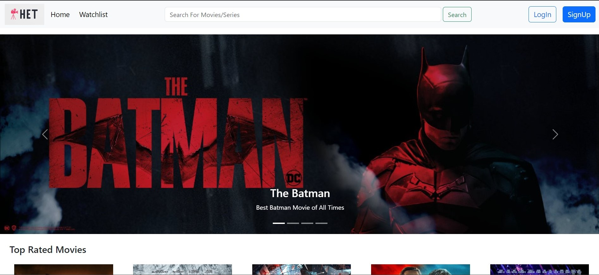
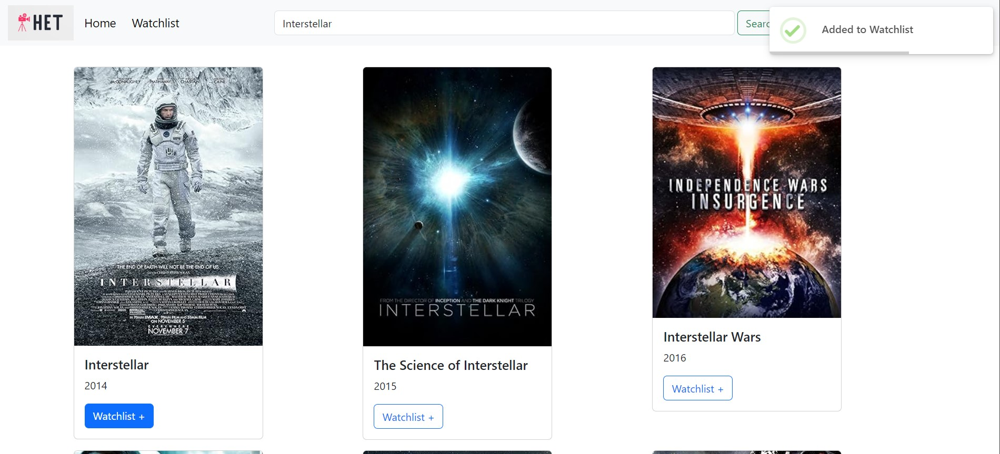
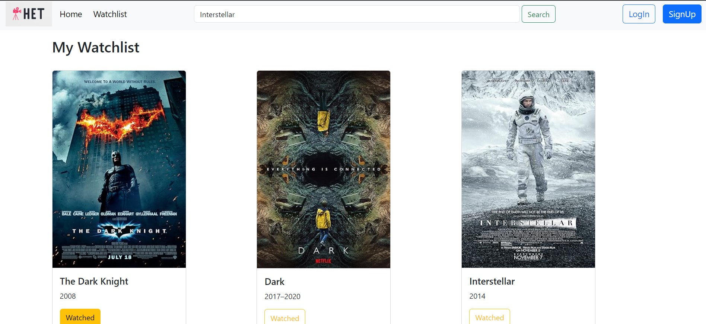

# 🎬  Movie App

Welcome to the **MERN Movie App**! This application lets you explore movies and manage your own watchlist by adding or removing movies.

## 🖼️ Screenshots

## Home Page


## Login & SignUp
<div align="center">
  
</div>

## Search Movies & Add to Watchlist


## Watch & Remove Movies you watched



## 🚀 Features

- **Search for Movies**: Fetch movie data using an external movie API.
- **Add Movies to Watchlist**: Easily add your favorite movies to your personal watchlist.
- **Remove Movies**: Remove movies from your watchlist once you’ve watched them.
- **Responsive Design**: The app works on both desktop and mobile devices.

## 🛠️ Tech Stack

- **MongoDB**: For storing the user’s watchlist.
- **Express.js**: For building the backend API.
- **React.js**: For creating the dynamic frontend user interface.
- **Node.js**: For server-side JavaScript.
- **Movie API**: Used to fetch the movie details from OMDB API.

## ⚙️ Installation

Follow these steps to get the project up and running locally:

1. **Clone the repository**:
    ```bash
    git clone https://github.com/hetbhalani/MERN-movie-app.git
    cd MERN-movie-app
    ```

2. **Install dependencies** for both client and server:
    ```bash
    # Install backend dependencies
    cd backend
    npm install
    
    # Install frontend dependencies
    cd ../frontend
    npm install
    ```

3. **Run the app**:
    ```bash
    # Start the server (backend)
    cd backend
    npm start

    # Start the client (frontend)
    cd ../frontend
    npm start
    ```

4. Open `http://localhost:3690` to view the app in your browser.


## 🌐 API Reference

This app uses **[The Open Movie Database (OMDB)](https://www.omdbapi.com/)** for fetching movie data. Make sure to sign up and get an API key.

## 🤝 Contributing

Feel free to contribute by submitting a pull request. Make sure your code follows the project's style and passes any tests.

## 🙏 Acknowledgments

- Thanks to **OMDB** for providing the movie data API.
